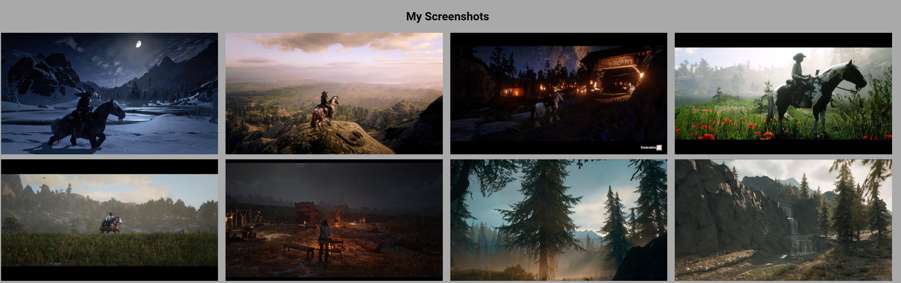
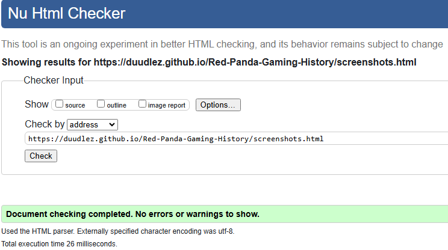

# Red Panda Gaming History

Red Panda Gaming History is a website that brings some gaming knowledge to you. These Infos range from the early games like Pong to AAA Games and the Games we have now. You will even see some of the biggest video game achievements. Come and learn a bit about Video Games [here](https://duudlez.github.io/Red-Panda-Gaming-History/)

## Features

### Site wide
* Navigation Menu
     * Contains links to  the Home, Gaming-History and Screenshots pages and will be responsive on all devices.
     * This will allow users to easily navigate between the pages on any size device.


* Footer
     * This will contain icons as links to social media websites that will open in new tabs. Icons will be accessible to the visually impaired who may be using a screen reader.
     * This will allow users to follow Red Panda Gaming History on various social media where they can stay up to date with Video Games.


* Favicon
     * A site wide red panda favicon will be implemented.
     * This will provide an image in the tabs header to allow the user to easily identify the website if they have multiple tabs open.


* 404 Page
     * A 404 page will be implemented and will display if a user navigates to a broken link.
     * The 404 page will allow the user to easily navigate back to the main website if they direct to a broken link / missing page, without the need of the browsers back button.


### Landing Page
* Landing page image
     * This will be an image of a Red Panda sitting at a pc.
     * This will show the user that the Website is about pc's and gaming.


* Website information on 'Red Panda'
     * Information about 'Red Panda' and the websites purpose.
     * This information let's the user know what the site is about.


* Contact form
     * A contact form will be implemented to allow users to contact 'Red Panda'. The form will consist of the following fields and attributes:
          * First Name (required, type=text)
          * Last Name (required, type=text)
          * Email (required, type=email)
          * Message (required, type=textarea)
    * On successful submission of the contact form, the user will be navigated to contact.html displaying a success message.
    * This will allow the user to contact 'Red Panda' if they have any questions or suggestions about Gaming History.


### Screenshots
* Screenshots
     * The screenshots section will provide the user with a small selection of Screenshots made by Red Panda and his Friends.
     * These screenshots show a few games Red Panda and his friends have played.


<br><br><br><br>


## Technologies

* HTML
     * The structure of the Website was developed using HTML as the main language.
* CSS 
     * The website was styled using custom CSS in an external file.
* GitHub
     * Used as IDE and used to commit and push code during the developement of the Website.
* Font Awesome
     * Icons obtained from https://fontawesome.com/ were used to create the Social links in the footer.
* jpg2avif
     * https://jpg2avif.com/ was used to reduce the size of images used on the website
* Faicon.io
     * favicon files were created at https://favicon.io/favicon-converter/


## Testing

### Responsiveness

All pages were tested to ensure responsiveness on screen sizes from 320px and upwards.

Steps to test:

1. Open Browser an navigate to [Red Panda Gaming History](https://duudlez.github.io/Red-Panda-Gaming-History/)
2. Open the developer tools (right click and inspect)
3. Switched screen sizes Mobile S, Mobile M, Mobile L, Tablet, Laptop, Laptop L and 4k.

### Accessibility

[Wave Accessibility](https://wave.webaim.org/) tool was used throughout development and for final testing of the deployed website to check for any aid accessibility testing.

Testing was focused to ensure the following criteria were met:

- All forms have associated labels or aria-labels so that this is read out on a screen reader to users who tab to form inputs
- Color contrasts meet a minimum ratio as specified in [WCAG 2.1 Contrast Guidelines](https://www.w3.org/WAI/WCAG21/Understanding/contrast-minimum.html)
- Heading levels are not missed or skipped to ensure the importance of content is relayed correctly to the end user
- All content is contained within landmarks to ensure ease of use for assistive technology, allowing the user to navigate by page regions
- All not textual content had alternative text or titles so descriptions are read out to screen readers
- HTML page lang attribute has been set
- Aria properties have been implemented correctly
- WCAG 2.1 Coding best practices being followed

### Validator Testing

- HTML
  - No errors were returned when passing through the official [W3C validator](https://validator.w3.org)





- CSS
  - No errors were found when passing through the official [(Jigsaw) validator](https://jigsaw.w3.org)


## Deployment

### Version Control

The site was created using the Visual Studio code editor and pushed to github to the remote repository ‘Red-Panda-Gaming-History’.

The following git commands were used throughout development to push code to the remote repo:

```git add <file>``` - This command was used to add the file(s) to the staging area before they are committed.

```git commit -m “commit message”``` - This command was used to commit changes to the local repository queue ready for the final step.

```git push``` - This command was used to push all committed code to the remote repository on github.

### Deployment to Github Pages

- The site was deployed to GitHub pages. The steps to deploy are as follows: 
  - In the GitHub repository, navigate to the Settings tab 
  - From the menu on left select 'Pages'
  - From the source section drop-down menu, select the Branch: main
  - Click 'Save'
  - A live link will be displayed in a green banner when published successfully. 

The live link can be found here - https://duudlez.github.io/Red-Panda-Gaming-History/